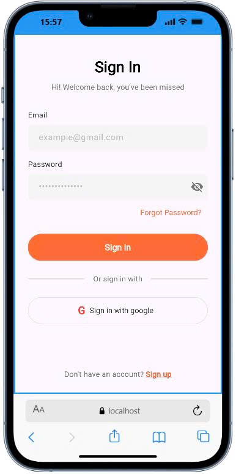
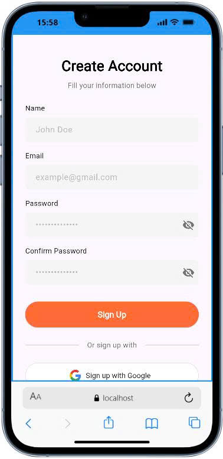
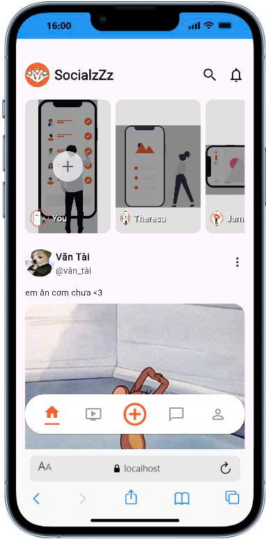
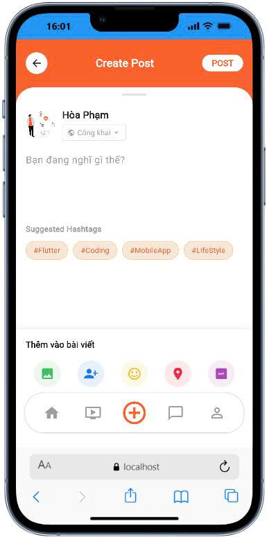
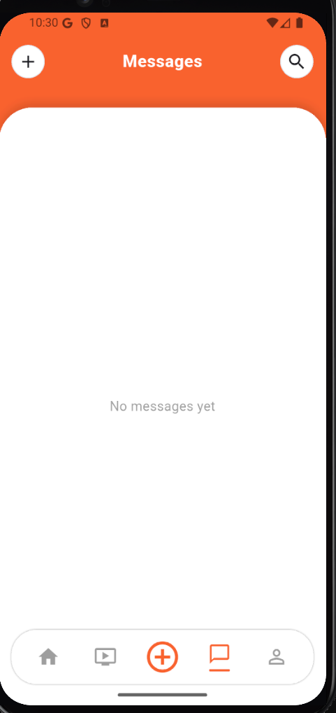
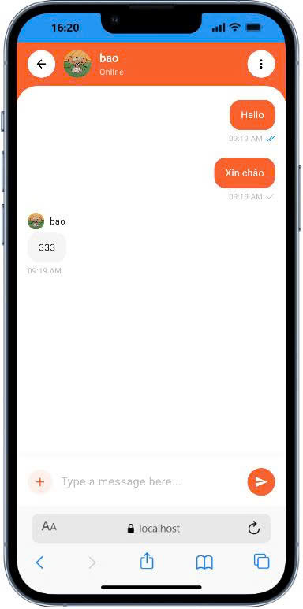
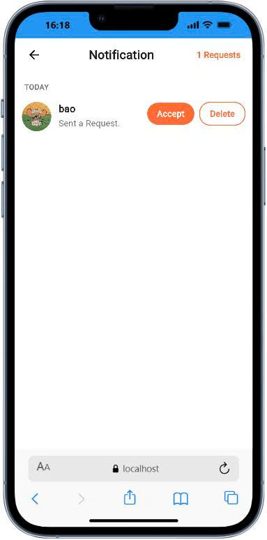

# SocialzZz - Flutter Mobile App

<div align="center">


**Ứng dụng mạng xã hội cross-platform được xây dựng với Flutter**

</div>

## 📱 Tổng quan

**SocialzZz** là ứng dụng mạng xã hội cross-platform (Android, iOS, Web) được phát triển bằng **Flutter**, cung cấp trải nghiệm người dùng mượt mà với các tính năng đầy đủ như đăng bài, nhắn tin real-time, kết bạn và nhiều hơn nữa. Ứng dụng sử dụng **Material Design 3**, **Socket.io** cho real-time communication, và **HTTP** cho REST API calls.

## � Screenshots

<div align="center">

### 🔐 Authentication & Onboarding

<p>
  
  
</p>

### 🏠 Home & Feed

<p>
  
  
</p>

### 💬 Messaging

<p>
  
  
  
</p>

### 🔔 Notifications & Friends

<p>
  
</p>

</div>

## 🛠️ Tech Stack

| Category           | Package                     | Version |
| ------------------ | --------------------------- | ------- |
| **Framework**      | Flutter                     | 3.24.5  |
| **Language**       | Dart                        | 3.5.4   |
| **Navigation**     | go_router                   | 14.6.2  |
| **HTTP Client**    | http                        | 1.2.2   |
| **HTTP Client**    | dio                         | 5.7.0   |
| **Real-time**      | socket_io_client            | 2.0.3+1 |
| **Authentication** | google_sign_in              | 6.3.0   |
| **Backend**        | supabase_flutter            | 2.9.1   |
| **Storage**        | shared_preferences          | 2.3.3   |
| **Environment**    | flutter_dotenv              | 5.2.1   |
| **Media**          | image_picker                | 1.1.2   |
| **Video**          | video_player                | 2.9.2   |
| **SVG**            | flutter_svg                 | 2.0.16  |
| **Grid**           | flutter_staggered_grid_view | 0.7.0   |
| **Shimmer**        | shimmer                     | 3.0.0   |
| **Cache Image**    | cached_network_image        | 3.4.1   |
| **Intl**           | intl                        | 0.20.1  |
| **URL Launcher**   | url_launcher                | 6.3.1   |

## ✨ Các tính năng chính

### 🔐 Xác thực & Bảo mật

- ✅ Đăng ký/Đăng nhập với Email & Password
- ✅ Đăng nhập với Google OAuth 2.0
- ✅ JWT token authentication
- ✅ Refresh token tự động
- ✅ Persistent login session
- ✅ Token management với TokenManager

### � Quản lý bài viết

- ✅ Tạo bài viết với text, ảnh, video
- ✅ Thêm cảm xúc (feelings) vào bài viết
- ✅ Thêm vị trí (location)
- ✅ Thêm GIF từ thư viện
- ✅ Tag bạn bè trong bài viết
- ✅ Hashtags support
- ✅ Cài đặt quyền riêng tư (Public/Friends/Private)
- ✅ Chỉnh sửa và xóa bài viết
- ✅ Xem chi tiết bài viết

### � Tương tác xã hội

- ✅ Bình luận bài viết
- ✅ Real-time updates

### 👥 Kết bạn & Theo dõi

- ✅ Gửi/Nhận lời mời kết bạn
- ✅ Chấp nhận/Từ chối lời mời
- ✅ Danh sách bạn bè
- ✅ Danh sách người theo dõi/đang theo dõi
- ✅ Gợi ý kết bạn
- ✅ Kiểm tra trạng thái kết bạn

### 💬 Nhắn tin Real-time

- ✅ Chat 1-1 với WebSocket (Socket.io)
- ✅ Gửi/nhận tin nhắn real-time
- ✅ Danh sách cuộc hội thoại
- ✅ Đánh dấu đã đọc (read receipts)
- ✅ Chọn người dùng để chat
- ✅ Hiển thị trạng thái online/offline
- ✅ Message history

### 🔔 Thông báo

- ✅ Thông báo kết bạn
- ✅ Badge đếm thông báo chưa đọc
- ✅ Real-time notifications

### 🔍 Tìm kiếm & Khám phá

- ✅ Tìm kiếm người dùng
- ✅ Tìm kiếm bài viết
- ✅ Tìm kiếm theo hashtag
- ✅ Tìm kiếm địa điểm
- ✅ Tab navigation (Accounts, Hashtags, Places, Reels)

### 👤 Hồ sơ cá nhân

- ✅ Xem và chỉnh sửa profile
- ✅ Thay đổi avatar
- ✅ Xem bài viết của bản thân
- ✅ Thống kê (số bạn bè, bài viết)
- ✅ Cài đặt tài khoản

## 📁 Cấu trúc dự án

```
lib/
├── data/                             # Data layer
│   ├── models/                       # Data models
│   │   ├── user_model.dart          # User model
│   │   ├── post_model.dart          # Post model
│   │   ├── message.dart             # Message & Conversation models
│   │   ├── comment_model.dart       # Comment model
│   │   ├── notification_item.dart   # Notification model
│   │   ├── follow_item.dart         # Follow/Follower model
│   │   ├── search_item.dart         # Search result model
│   │   ├── media_asset_model.dart   # Media asset model
│   │   ├── step_model.dart          # Onboarding step model
│   │   ├── status_data.dart         # Status model
│   │   ├── live_card_data.dart      # Live card model
│   │   └── setting_item.dart        # Setting item model
│   │
│   └── services/                     # API services
│       ├── token_manager.dart       # Token management (singleton)
│       ├── user_service.dart        # User API
│       ├── post_service.dart        # Post API
│       ├── message_service.dart     # Message API & WebSocket
│       ├── socket_service.dart      # Socket.io service
│       ├── notification_service.dart # Notification API
│       ├── follow_service.dart      # Follow/Friend API
│       ├── search_service.dart      # Search API
│       └── media_asset_service.dart # Media API
│
├── representation/                   # Presentation layer (UI)
│   ├── splash/                      # Splash screen
│   │   └── splash_screen.dart
│   │
│   ├── welcome/                     # Welcome screen
│   │   └── welcome.dart
│   │
│   ├── step/                        # Onboarding
│   │   ├── step_screen.dart
│   │   └── step_item.dart
│   │
│   ├── auth/                        # Authentication
│   │   ├── auth_service.dart       # Auth API service
│   │   ├── login_screen.dart       # Login UI
│   │   └── register_screen.dart    # Register UI
│   │
│   ├── home/                        # Home feed
│   │   ├── main_screen.dart        # Main container với bottom nav
│   │   ├── home_screen.dart        # Feed UI
│   │   ├── home_header.dart        # Header widget
│   │   ├── status_card_widget.dart # Status card
│   │   └── live_card_widget.dart   # Live card
│   │
│   ├── post/                        # Post management
│   │   ├── screens/
│   │   │   ├── create_post_screen.dart
│   │   │   └── reaction_list_screen.dart
│   │   ├── controllers/
│   │   │   ├── create_post_controller.dart
│   │   │   └── reaction_controller.dart
│   │   ├── widgets/
│   │   │   ├── post_header.dart
│   │   │   ├── post_action_bar.dart
│   │   │   ├── post_image_grid.dart
│   │   │   ├── post_input.dart
│   │   │   ├── reaction_counter.dart
│   │   │   └── reaction_item.dart
│   │   ├── sheets/
│   │   │   ├── feeling_sheet.dart
│   │   │   ├── image_picker_sheet.dart
│   │   │   ├── privacy_sheet.dart
│   │   │   └── tag_friend_sheet.dart
│   │   ├── create_post_screen.dart  # Legacy
│   │   └── reaction_list_screen.dart # Legacy
│   │
│   ├── message/                     # Messaging
│   │   ├── message_list_screen.dart # Conversations list
│   │   ├── chat_detail_screen.dart  # Chat UI
│   │   ├── select_user_screen.dart  # User selection
│   │   ├── message_header.dart      # Message header widget
│   │   └── message_item.dart        # Message item widget
│   │
│   ├── comment/                     # Comments
│   │   ├── comment_screen.dart
│   │   └── comment_item.dart
│   │
│   ├── profile/                     # User profile
│   │   ├── profile_screen.dart
│   │   ├── editprofile_screen.dart
│   │   └── avatar_picker_sheet.dart
│   │
│   ├── search/                      # Search & discovery
│   │   ├── search_screen.dart
│   │   ├── search_header.dart
│   │   ├── search_tabs.dart
│   │   ├── account_list.dart
│   │   ├── hashtag_list.dart
│   │   ├── place_list.dart
│   │   ├── reel_list.dart
│   │   ├── avatar_widget.dart
│   │   └── follow_button.dart
│   │
│   ├── notification/                # Notifications
│   │   ├── notification_screen.dart
│   │   ├── notification_manager.dart
│   │   ├── notification_header.dart
│   │   ├── notification_list_widget.dart
│   │   ├── notification_item_widget.dart
│   │   ├── request_buttons.dart
│   │   ├── avatar_placeholder.dart
│   │   └── post_preview_placeholder.dart
│   │
│   ├── follow/                      # Friends & followers
│   │   ├── followers_screen.dart
│   │   └── following_screen.dart
│   │
│   ├── setting/                     # Settings
│   │   └── setting_screen.dart
│   │
│   └── video/                       # Video player
│       └── video_screen.dart
│
├── routes/                           # Navigation
│   ├── app_router.dart              # Route definitions
│   └── route_names.dart             # Route constants
│
├── widgets/                          # Reusable widgets
│   ├── app_bottom_navbar.dart       # Bottom navigation bar
│   ├── circle_icon_btn.dart         # Circular icon button
│   ├── video_player_item.dart       # Video player widget
│   ├── post_skeleton.dart           # Skeleton loading
│   └── show_snackbar.dart           # Snackbar helper
│
├── app.dart                          # App widget
└── main.dart                         # Entry point
```

## 🚀 Hướng dẫn Cài đặt và Chạy

### 1️⃣ Chuẩn bị môi trường

- Flutter SDK >= 3.24.5
- Dart SDK >= 3.5.4
- Android Studio / VS Code
- Android SDK (cho Android) hoặc Xcode (cho iOS)
- Git

### 2️⃣ Clone & Install

```bash
# Clone repository
git clone https://github.com/SocialzZz/SocialzZz.git
cd SocialzZz/socialzzz

# Cài đặt dependencies
flutter pub get
```

### 3️⃣ Cấu hình môi trường

Tạo file `.env`:

```env
# Supabase Config
SUPABASE_URL=your_supabase_url
SUPABASE_ANON_KEY=your_supabase_anon_key

# Google Auth Config
GOOGLE_WEB_CLIENT_ID=your_google_web_client_id
GOOGLE_IOS_CLIENT_ID=your_google_ios_client_id
GOOGLE_ANDROID_CLIENT_ID=your_google_android_client_id

# API URL Configuration
# Android Emulator
API_URL=http://10.0.2.2:3000

# iOS Simulator / Web
# API_URL=http://localhost:3000

# Thiết bị thật (cùng WiFi)
# API_URL=http://YOUR_COMPUTER_IP:3000

# Production
# API_URL=https://api.socialzzz.com
```

### 4️⃣ Chạy ứng dụng

```bash
# Kiểm tra devices
flutter devices

# Chạy trên device cụ thể
flutter run -d android
flutter run -d ios
flutter run -d chrome

# Hoặc chọn device
flutter run
```

### 5️⃣ Build Production

```bash
# Android APK
flutter build apk --release

# Android App Bundle (cho Google Play)
flutter build appbundle --release

# iOS
flutter build ios --release

# Web
flutter build web --release
```

## 🔧 Cấu hình theo môi trường

### Development (Local)

```env
API_URL=http://localhost:3000
```

### Android Emulator

```env
API_URL=http://10.0.2.2:3000
```

### iOS Simulator

```env
API_URL=http://localhost:3000
```

### Thiết bị thật (cùng WiFi)

```bash
# Kiểm tra IP máy tính
# Windows: ipconfig
# macOS/Linux: ifconfig

# Cập nhật .env
API_URL=http://192.168.1.100:3000
```

### Production

```env
API_URL=https://api.socialzzz.com
```

## 📖 Hướng dẫn Sử dụng

### Đăng ký & Đăng nhập

1. Mở app lần đầu → **Splash Screen** → **Welcome Screen**
2. Chọn **"Sign Up"** để đăng ký:
   - Nhập email, password, tên
   - Hoặc đăng ký bằng Google
3. Chọn **"Sign In"** để đăng nhập
4. Sau khi đăng nhập → **Home Feed**

### Tạo bài viết mới

1. Nhấn nút **"+"** ở bottom navigation
2. Nhập nội dung bài viết
3. **Thêm media** (tùy chọn):
   - Nhấn icon ảnh để chọn từ thư viện
   - Hoặc chụp ảnh mới
4. **Tag bạn bè** (tùy chọn)
5. **Chọn quyền riêng tư**: Public, Private
6. Nhấn **"POST"**

### Tương tác với bài viết

- **Comments**: Nhấn icon Comment → Nhập comment

### Nhắn tin Real-time

1. Vào tab **"Messages"**
2. Nhấn **"+"** để bắt đầu chat mới
3. Chọn user từ danh sách
4. Nhập tin nhắn và gửi
5. Tin nhắn được cập nhật real-time

### Kết bạn

1. Tìm kiếm người dùng trong tab **Search**
2. Vào profile → Nhấn **"Add Friend"**
3. Đợi họ chấp nhận lời mời
4. Xem danh sách bạn bè trong **Profile**

## 🧪 Testing

```bash
# Run all tests
flutter test

# Run with coverage
flutter test --coverage

# Run integration tests
flutter test integration_test
```

## 🐛 Troubleshooting

### API Connection Error

```
ClientException: Failed to connect to localhost:3000
```

**Giải pháp:**

```env
# Android Emulator
API_URL=http://10.0.2.2:3000

# iOS Simulator
API_URL=http://localhost:3000

# Thiết bị thật
API_URL=http://YOUR_COMPUTER_IP:3000
```

### Google Sign In Failed

```
PlatformException: sign_in_failed
```

**Giải pháp:**

**Android:**

```bash
# Lấy SHA-1 fingerprint
keytool -list -v -keystore ~/.android/debug.keystore -alias androiddebugkey -storepass android -keypass android

# Thêm SHA-1 vào Google Cloud Console
```

**iOS:**

```xml
<!-- ios/Runner/Info.plist -->
<key>CFBundleURLTypes</key>
<array>
    <dict>
        <key>CFBundleURLSchemes</key>
        <array>
            <string>com.googleusercontent.apps.YOUR-CLIENT-ID</string>
        </array>
    </dict>
</array>
```

### Image Picker Not Working

```bash
# Clean và rebuild
flutter clean
flutter pub get
flutter run
```

**Android permissions:**

```xml
<!-- android/app/src/main/AndroidManifest.xml -->
<uses-permission android:name="android.permission.READ_EXTERNAL_STORAGE"/>
<uses-permission android:name="android.permission.WRITE_EXTERNAL_STORAGE"/>
<uses-permission android:name="android.permission.CAMERA"/>
```

**iOS permissions:**

```xml
<!-- ios/Runner/Info.plist -->
<key>NSPhotoLibraryUsageDescription</key>
<string>We need access to your photo library</string>
<key>NSCameraUsageDescription</key>
<string>We need access to your camera</string>
```

### WebSocket Not Connecting

```dart
// Kiểm tra MessageService initialization
// Restart app sau khi login
```

## 📱 Platform Support

| Platform | Supported | Min Version          |
| -------- | --------- | -------------------- |
| Android  | ✅        | API 21 (Android 5.0) |
| iOS      | ✅        | iOS 12.0             |
| Web      | ✅        | Chrome, Safari, Edge |
| macOS    | ⚠️        | Experimental         |
| Windows  | ⚠️        | Experimental         |
| Linux    | ⚠️        | Experimental         |

## 🤝 Contributing

1. Fork repository
2. Create branch: `git checkout -b feature/AmazingFeature`
3. Commit: `git commit -m 'feat: Add AmazingFeature'`
4. Push: `git push origin feature/AmazingFeature`
5. Open Pull Request

## 📄 License

MIT License - Xem file [LICENSE](../LICENSE)

## 📞 Liên hệ

- **GitHub**: [SocialzZz Flutter](https://github.com/SocialzZz/SocialzZz)
- **Email**: doanbao690@gmail.com

## 📚 Resources

- [Flutter Documentation](https://docs.flutter.dev/)
- [Dart Language Tour](https://dart.dev/guides/language/language-tour)
- [Material Design 3](https://m3.material.io/)
- [Socket.io Client](https://pub.dev/packages/socket_io_client)

---

<div align="center">
Made with ❤️ using Flutter
</div>
